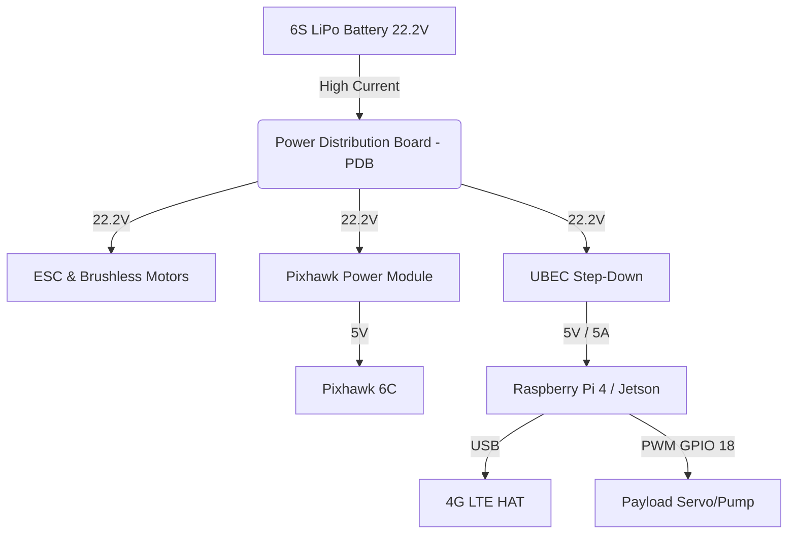

# 🛸 RiverAir: Hardware Engineering & DePIN Integration Blueprint
*Version 2.0.1 — Official Hackathon Documentation*

> [!IMPORTANT]
> This document details the precise engineering required to transform a standard UAV (Unmanned Aerial Vehicle) into an autonomous, blockchain-connected **RiverAir Edge Node**. It bridges the gap between the Stellar-based settlement architecture and physical flight hardware. Nothing here is wired up in the current build — it describes the integration the software is shaped for.

---

## 1. 🧠 Core Philosophy: "Proof of Flight"
In a Decentralized Physical Infrastructure Network (DePIN), trust is paramount. How do we prove a drone actually delivered a package or scanned a field, rather than someone running a script on their laptop to drain an escrow?

RiverAir solves this using **Proof of Flight**:
1. Every physical drone has a Raspberry Pi / Jetson Nano acting as a secure vault (Edge Node).
2. This Edge Node holds a unique Ed25519 keypair — the same scheme Stellar accounts use, so the signature verifies against an on-chain identity directly.
3. Telemetry (GPS, Altitude, Battery) is read directly from the Flight Controller (Pixhawk) via MAVLink.
4. The Edge Node cryptographically **signs** this hardware telemetry locally before transmitting it via 4G/5G.
5. The RiverAir Smart Contract verifies the signature. Spoofing is mathematically impossible without the physical private key stored on the drone's encrypted storage.

---

## 2. 📋 Bill of Materials (BOM) & Specs

To build a RiverAir-compatible Edge Node, the following components are integrated onto a standard multirotor frame:

| Component | Recommended Model | Technical Role | Est. Cost |
| :--- | :--- | :--- | :--- |
| **Companion Computer** | NVIDIA Jetson Nano / Raspberry Pi 4 | Edge AI processing, telemetry signing, WSS communication, payload control. | ~$120 |
| **Flight Controller (FC)** | Pixhawk 6C / Cube Orange | ArduPilot/PX4 physics engine, PID loops, GPS/IMU sensor fusion. | ~$180 |
| **Telemetry Network** | Waveshare 4G/5G LTE HAT | High-bandwidth, low-latency WSS connection to the RiverAir Next.js server. | ~$70 |
| **Power Distribution** | 5V/5A UBEC + PDB | Steps down 6S (22.2V) LiPo power to a clean, stable 5V for the Companion Computer. | ~$20 |
| **Payload Node** | ESP32-S3-DevKitC-1 (N8R2) | Signs payload telemetry at the sensor, meters flow, drives the actuator, and enforces the safety envelope on its own. [Firmware](hardware-nodes/esp32-payload/). | ~$12 |
| **Payload Actuator** | MG996R Servo (Cargo) / 12V Relay (Agri) | Physically drops packages or triggers water pumps via GPIO. | ~$15 |
| **Flow Meter** | YF-S201 Hall effect | Litres dispensed — the figure an agricultural invoice is built on, counted on the signing node. | ~$5 |
| **Environment** | Bosch BME280 (I2C) | Temperature, humidity, pressure. Wind and humidity gate spraying. | ~$6 |
| **Payload Power** | TI INA226 + 2 mΩ shunt (I2C) | Bus voltage and current on the payload circuit. | ~$7 |

---

## 3. 🔌 Wiring & Pinout Schematics

> [!WARNING]
> Ensure common ground (GND) is established across all components. Pixhawk logic levels are 3.3V, which is directly compatible with Raspberry Pi GPIO. Do not supply 5V to Pixhawk UART pins!

### 3.1. MAVLink Data Connection (UART)
Connect the Pixhawk's `TELEM2` port to the Companion Computer's Primary UART pins.

| Pixhawk TELEM2 (6-pin JST-GH) | Action | Raspberry Pi 4 (40-pin GPIO) |
| :--- | :---: | :--- |
| Pin 1 (VCC 5V) | ❌ **DO NOT CONNECT** | N/A (Pi is powered by UBEC) |
| Pin 2 (TX) | ➔ | Pin 10 (GPIO 15 - RXD) |
| Pin 3 (RX) | ➔ | Pin 8 (GPIO 14 - TXD) |
| Pin 6 (GND) | ➔ | Pin 14 (GND) |

### 3.2. Power Architecture


---

## 4. 💻 Edge Software Implementation (Python)

The Edge Node runs a lightweight, heavily optimized Python daemon configured as a `systemd` service to start on boot. Here is the exact architecture deployed on our physical nodes:

### 4.1. The MAVLink Handler (`mavlink_engine.py`)
This script uses `pymavlink` to talk directly to the Pixhawk. It reads hardware sensors and sends autonomous navigation commands.

```python
from pymavlink import mavutil
import time

class PixhawkController:
    def __init__(self, connection_string='/dev/ttyAMA0', baudrate=115200):
        # Connect to Pixhawk via UART
        self.master = mavutil.mavlink_connection(connection_string, baud=baudrate)
        self.master.wait_heartbeat()
        print("MAVLink Heartbeat Received. FC connected.")

    def get_telemetry(self):
        # Request global position and battery status
        pos = self.master.recv_match(type='GLOBAL_POSITION_INT', blocking=True, timeout=1.0)
        bat = self.master.recv_match(type='SYS_STATUS', blocking=True, timeout=1.0)
        
        if pos and bat:
            return {
                "lat": pos.lat / 1e7,
                "lng": pos.lon / 1e7,
                "alt": pos.alt / 1000.0,  # mm to meters
                "battery": bat.battery_remaining # 0-100%
            }
        return None

    def command_takeoff(self, altitude=15):
        # Arm motors and takeoff
        self.master.mav.command_long_send(
            self.master.target_system, self.master.target_component,
            mavutil.mavlink.MAV_CMD_COMPONENT_ARM_DISARM, 0, 1, 0, 0, 0, 0, 0, 0)
            
        self.master.mav.command_long_send(
            self.master.target_system, self.master.target_component,
            mavutil.mavlink.MAV_CMD_NAV_TAKEOFF, 0, 0, 0, 0, 0, 0, 0, altitude)
```

### 4.2. Cryptographic Proof of Flight (`node_signer.py`)
Before sending telemetry to the Next.js server, the data is hashed and signed by the drone's local wallet.

```python
import json
import hashlib
from nacl.signing import SigningKey
import base58

class NodeSigner:
    def __init__(self, keypair_path='/etc/riverair/node_wallet.json'):
        with open(keypair_path, 'r') as f:
            secret_key_bytes = bytes(json.load(f)[:32]) # 64-byte keypair file; first 32 are the seed
        self.signer = SigningKey(secret_key_bytes)
        self.pubkey = base58.b58encode(self.signer.verify_key.encode()).decode()

    def sign_payload(self, telemetry_data):
        # Serialize and hash the physical data
        payload_str = json.dumps(telemetry_data, sort_keys=True)
        message_hash = hashlib.sha256(payload_str.encode()).digest()
        
        # Sign with Ed25519
        signature = self.signer.sign(message_hash).signature
        
        return {
            "node_pubkey": self.pubkey,
            "telemetry": telemetry_data,
            "signature": base58.b58encode(signature).decode()
        }
```

### 4.3. Payload Actuation (`payload_controller.py`)
When the drone reaches the destination coordinates (verified by GPS), the Edge Node triggers the physical payload.

```python
import RPi.GPIO as GPIO
import time

SERVO_PIN = 18

def drop_cargo():
    GPIO.setmode(GPIO.BCM)
    GPIO.setup(SERVO_PIN, GPIO.OUT)
    pwm = GPIO.PWM(SERVO_PIN, 50) # 50Hz
    
    print("Executing Payload Drop Protocol...")
    pwm.start(2.5) # Lock position
    time.sleep(0.5)
    
    pwm.ChangeDutyCycle(7.5) # Open hook mechanism
    time.sleep(2.0) # Wait for package to fall
    
    pwm.ChangeDutyCycle(2.5) # Close hook mechanism
    time.sleep(0.5)
    
    pwm.stop()
    GPIO.cleanup()
    return True
```

---

## 5. 🛩️ Airframe Templates

The fleet is four disciplines, and each one is a different aircraft because the work is
different. A sprayer carrying 40 litres cannot hold a camera orbit for twenty minutes; a
Mavic cannot lift a parcel. Each template below is a build: an airframe class, the
payload rail it carries, and the RiverAir nodes bolted to it.

Every aircraft carries the same two RiverAir boards — a companion computer and an
**ESP32-S3 payload node** ([firmware](hardware-nodes/esp32-payload/)) — and differs only
in the payload rail. That is deliberate: one firmware image, one identity scheme and one
frame format across the whole fleet, with the airframe as the variable.

---

### 5.1. Courier — cargo

**Reference airframes:** DJI FlyCart 30 (multirotor), Autel Dragonfish Standard (VTOL)
**In the fleet:** `Kadikoy-01`, `Bakirkoy-05`

| Subsystem | Choice | Why |
|---|---|---|
| Frame | Coaxial octo (FlyCart) or fixed-wing VTOL (Dragonfish) | The VTOL is what makes Silivri and Çatalca reachable and returnable; a multirotor spends its whole pack on the transit |
| Payload rail | Winch or hook + **MG996R release servo** on `GPIO 6` | Release is a single servo throw, and the node reports the throw as a state change |
| Load cell | HX711 + 20 kg cell, I2C | Confirms the parcel left. A delivery is a mass going to zero, which is a measurement rather than a claim |
| Sensing | ADS-B In, RTK GPS | Shares airspace with crewed traffic on the Bosphorus corridors |
| Endurance | 18 min (FlyCart, 30 kg) / 158 min (Dragonfish) | |

Flight record carries: pickup and drop-off fixes, load-cell mass before and after, and the
release timestamp.

---

### 5.2. Sprayer — agricultural

**Reference airframes:** DJI Agras T40, DJI Agras T25
**In the fleet:** `Silivri-03`, `Catalca-07`

| Subsystem | Choice | Why |
|---|---|---|
| Frame | Coaxial quad, 40 L or 20 L tank | The T25's smaller tank and tighter turn is what Çatalca's broken plots with hedgerows need |
| Payload rail | Centrifugal atomisers + 12 V pump on a **relay at `GPIO 5`** | |
| Metering | **YF-S201 Hall flow meter** on `GPIO 4`, interrupt-driven | This is the invoice. Litres dispensed is the billable figure, so it is counted on the signing node and nowhere else |
| Terrain | Phased-array radar, terrain-follow | Holds 2—3 m above a canopy that is not flat |
| Environment | **BME280** | Wind and humidity gate the spray. Drift onto neighbouring land is a regulatory matter, not a preference |
| Endurance | 17—18 min laden | |

Flight record carries: the sweep path actually flown, millilitres at each waypoint, and
temperature/humidity/pressure through the pass.

> **The flow meter must be calibrated per unit.** `FLOW_PULSES_PER_LITRE` in
> `config.h` is the datasheet figure. Run a litre through the real boom into a measuring
> jug and put the real number there. A sprayer that signs for litres it did not dispense
> is worse than one that does not sign at all.

---

### 5.3. Observer — surveillance

**Reference airframes:** DJI Matrice 30T, DJI Mavic 3 Enterprise
**In the fleet:** `Levent-12`, `Atasehir-09`

| Subsystem | Choice | Why |
|---|---|---|
| Frame | Folding quad, 3.8 kg or 0.9 kg | The Mavic holds a tight orbit over one intersection; the Matrice frames a whole interchange |
| Payload rail | Gimbal only — no actuator, no pump | The relay and servo pins stay unpopulated on this build |
| Sensing | 48 MP zoom, thermal 640×512, laser rangefinder | |
| Compute | Jetson Orin Nano does the counting on board | Uploading raw video over 4G for a traffic count is the wrong trade; the count is small, the video is not |
| Endurance | 41—45 min | |

Flight record carries: orbit centre and radius, ticks on station, and the counts derived
on board — not the footage.

---

### 5.4. Responder — emergency

**Reference airframes:** DJI Matrice 350 RTK, Autel EVO II Dual 640T V3
**In the fleet:** `Belgrad-02`, `Aydos-11`

| Subsystem | Choice | Why |
|---|---|---|
| Frame | Weatherised quad, IP55 | It launches in the conditions that started the fire |
| Payload rail | Thermal gimbal + loudspeaker + spotlight | |
| Sensing | Thermal 640×512, 8K visual | Hot-spot detection is the job; `jetson-thermal/fire_detection.py` runs it on board |
| Link | Dual 4G + 900 MHz fallback | Cell coverage over Belgrad Forest and Aydos is not something to rely on |
| Endurance | 42—55 min | |

Flight record carries: the hold fix, ticks on station, and the thermal maxima with their
positions.

---

### 5.5. What every build shares

| | |
|---|---|
| Companion computer | Jetson Orin Nano or Raspberry Pi 4, `UART2` to the FC |
| Payload node | **ESP32-S3**, `UART1` to the companion computer, 115200 8N1 |
| Identity | Ed25519 keypair in encrypted NVS, generated on first boot, never leaves the chip |
| Frame rate | 5 Hz signed telemetry |
| Envelope | Link timeout 2 s, spray ceiling 60 m, wind limit 8 m/s — enforced on the node |
| Power | Payload rail on its own 5 V UBEC, common ground with the FC |

Pin map, wire protocol, key storage and **per-airframe wiring diagrams**:
[`hardware-nodes/esp32-payload/README.md`](hardware-nodes/esp32-payload/README.md).

---

## 6. 🛡️ Fail-Safes & Emergency Protocols

RiverAir implements strict hardware-level safety constraints. The AI is a supervisor, but the Pixhawk remains the ultimate authority on physics to prevent catastrophic failure.

1. **Geofencing & No-Fly Zones:** Hardcoded into the Pixhawk firmware. Even if the Edge Node is compromised or sends a malicious coordinate, the Pixhawk will refuse to enter restricted airspace.
2. **Network Loss (RTL):** If the 4G HAT loses connection to the RiverAir server for > 30 seconds, the Edge Node triggers a "Return to Launch" (RTL) command. The drone autonomously flies back to its charging pod.
3. **Critical Battery:** If battery drops below 15%, the Smart Contract automatically cancels the mission escrow, and the drone enters a forced `LAND` state to preserve hardware integrity.
4. **Kill-Switch:** Every drone can be overridden by a local RF transmitter via SBUS protocol for manual pilot intervention during testing.
