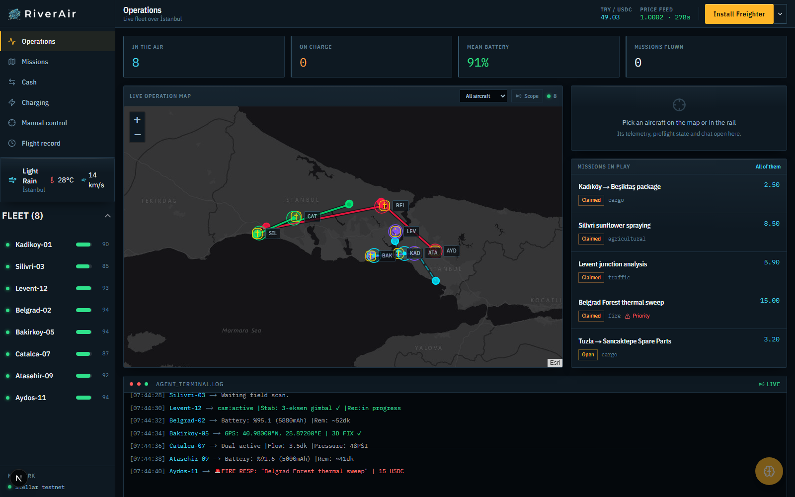
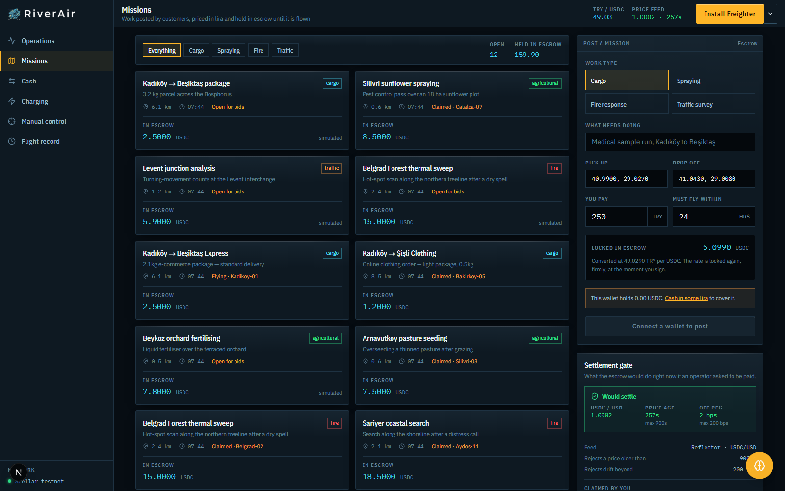
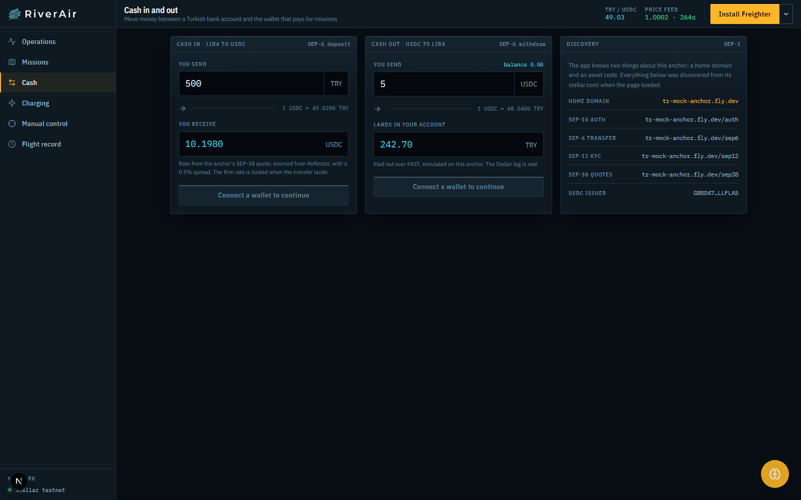
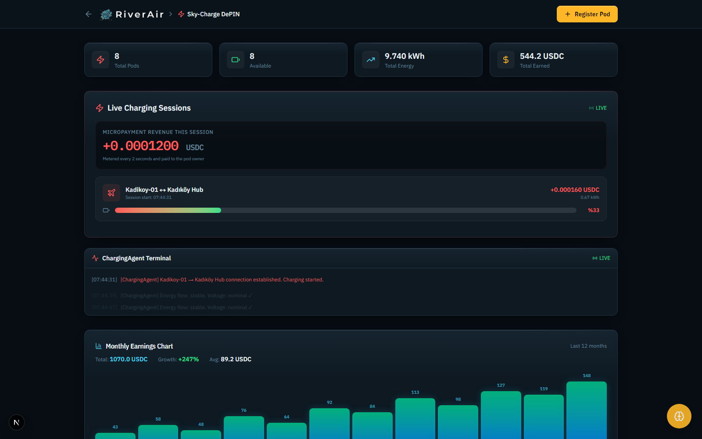
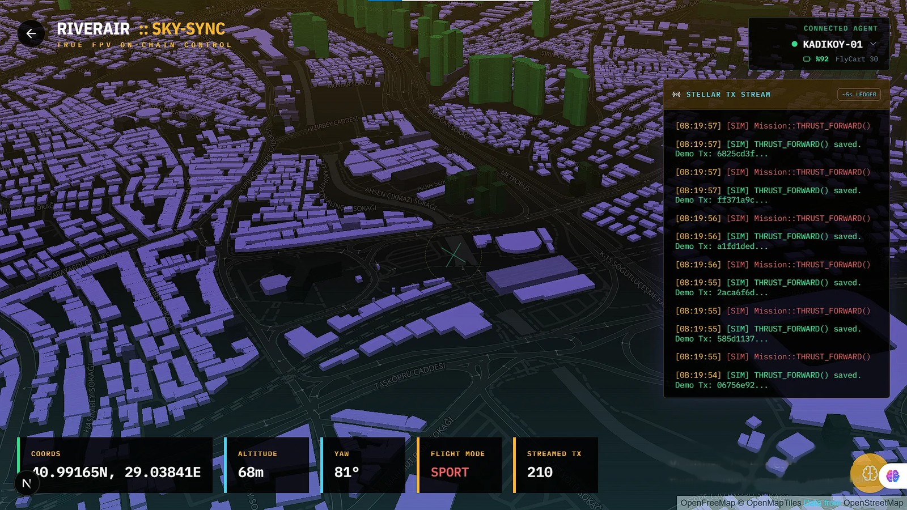
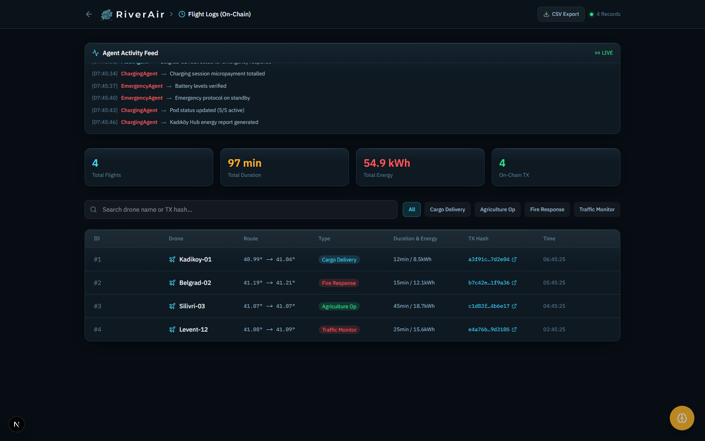
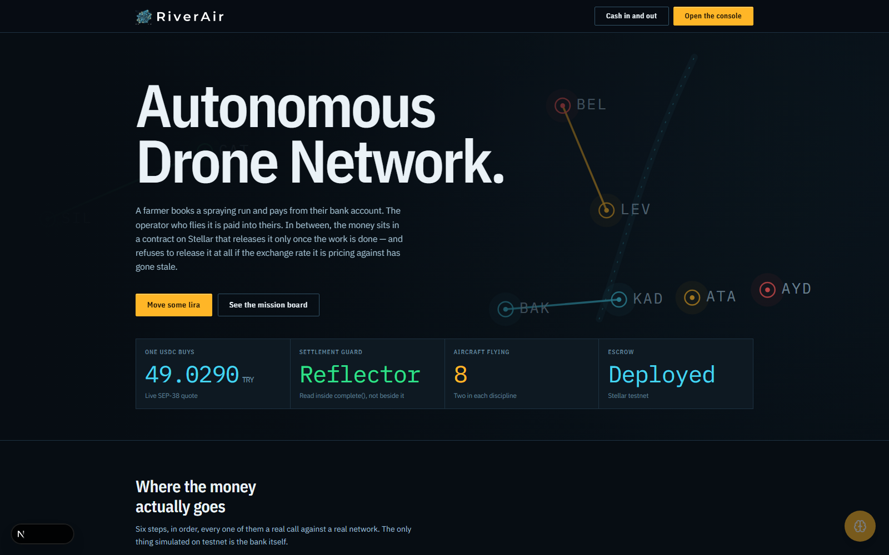
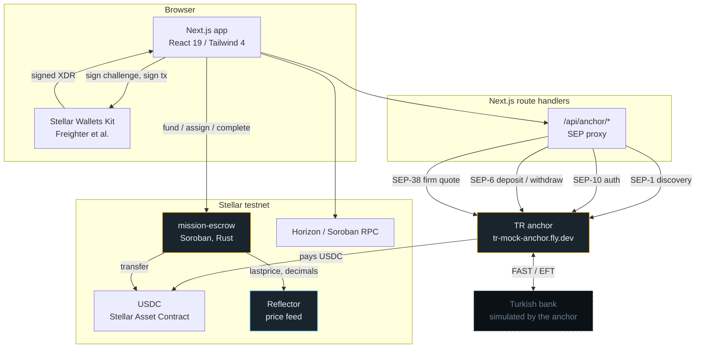
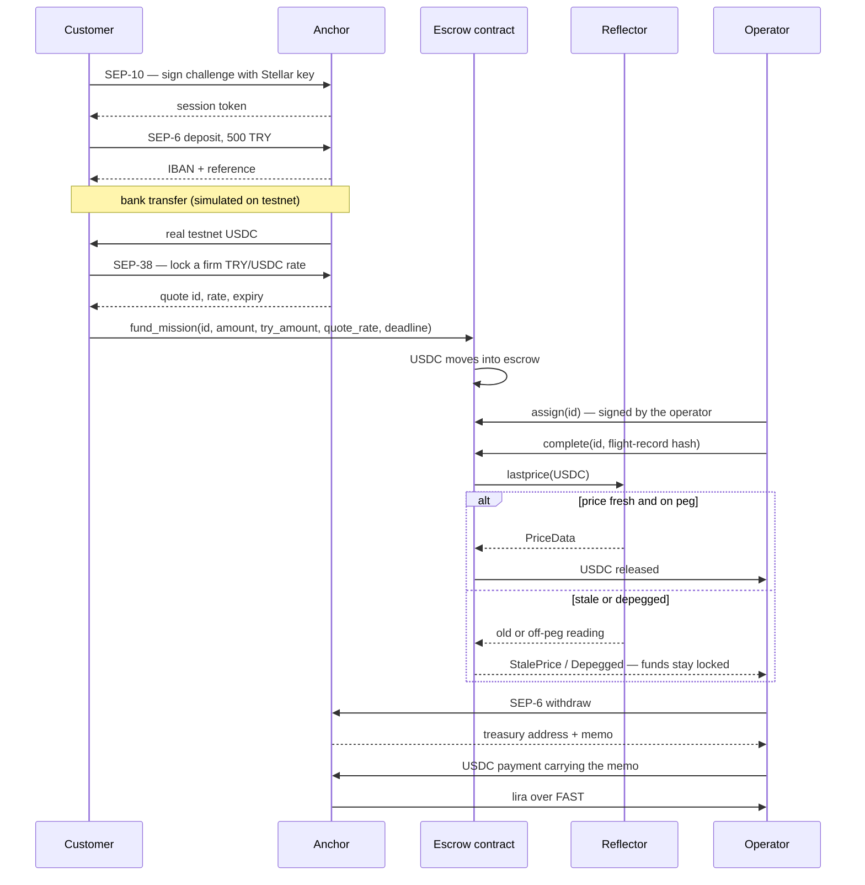

# RiverAir

**Drone work in Turkey, priced in lira and settled on Stellar.**

A farmer books a spraying run and pays from their bank account. The operator who flies it
is paid into theirs. In between, the money sits in a Soroban contract that releases it
only once the work is done — and refuses to release it at all if the price feed it is
settling against has gone stale.

Built for the Rise In × Stellar Pro Hackathon 2026, Genesis Track. Stellar testnet.

---

## On chain

| | |
|---|---|
| **Mission escrow** | [`CBCAST5V6PFVJCPPQNQWCXXCL3WNGJTQJQYQKKDIVO5C6VOVLPWFRLWC`](https://stellar.expert/explorer/testnet/contract/CBCAST5V6PFVJCPPQNQWCXXCL3WNGJTQJQYQKKDIVO5C6VOVLPWFRLWC) |
| **Reflector feed** | [`CCYOZJCOPG34LLQQ7N24YXBM7LL62R7ONMZ3G6WZAAYPB5OYKOMJRN63`](https://stellar.expert/explorer/testnet/contract/CCYOZJCOPG34LLQQ7N24YXBM7LL62R7ONMZ3G6WZAAYPB5OYKOMJRN63) |
| **USDC (SAC)** | [`CBIELTK6YBZJU5UP2WWQEUCYKLPU6AUNZ2BQ4WWFEIE3USCIHMXQDAMA`](https://stellar.expert/explorer/testnet/contract/CBIELTK6YBZJU5UP2WWQEUCYKLPU6AUNZ2BQ4WWFEIE3USCIHMXQDAMA) |
| **Anchor** | [`tr-mock-anchor.fly.dev`](https://tr-mock-anchor.fly.dev/.well-known/stellar.toml) — SEP-1, 6, 10, 12, 38 |
| **Network** | Stellar testnet, protocol 28 |
| **Source** | [`contracts/mission-escrow/src/lib.rs`](contracts/mission-escrow/src/lib.rs) — [13 tests](contracts/mission-escrow/src/test.rs), both oracle-refusal paths covered |

| Entry point | What it does |
|---|---|
| `fund_mission` | Moves USDC from the customer into the contract. Records the lira price and the rate it was struck at, so the payout can be audited against what was agreed |
| `assign` | An operator claims an open mission with their own key. Only that key can settle it |
| `complete` | **Reads Reflector, then releases.** Aborts on a stale or depegged price and leaves the funds locked |
| `cancel` | Refunds the customer. Open missions any time; claimed ones need the admin, or the deadline |
| `oracle_health` | The check `complete` runs, read-only, so a client can show why a payout would be refused |
| `settlement_usdc` | The lira → USDC arithmetic, on chain, so the figure on screen is the figure that settles |

---

## The problem

Turkish drone operators have a currency problem that has nothing to do with drones. Work
is quoted and paid in lira. Cross-border customers, equipment suppliers and cloud bills
are in dollars. The lira moves enough that the gap between agreeing a price and being paid
is itself a risk, and the escrow arrangements that would normally cover that risk do not
exist for a two-person operator flying agricultural jobs out past Çatalca.

RiverAir puts the money in a contract for the length of the job. The customer never leaves
lira. The operator never leaves lira. The dollar-denominated leg in the middle is
mechanical, auditable, and refuses to settle when the rate it depends on cannot be
trusted.

## An agentic fleet

The aircraft are agents, not vehicles waiting for orders.

Nobody dispatches them. There is no queue manager, no operator assigning work and no
central planner. Each aircraft reads the job board itself, works out which jobs it is
actually built for, picks one, flies it, and comes home. It watches its own battery and
takes itself off the board when it is too low to finish. If it misjudges its range in
flight it hands the job back rather than pressing on, and another aircraft takes it.

And **the work itself is autonomous**, not just the routing:

- The **sprayer** arrives over a marked plot and flies a lawnmower pattern across it on
  its own, descending as it works, opening the pump only inside the envelope it is
  authorised for. The flow meter on board counts the litres it actually dispensed, and
  that count is what the invoice is built from.
- The **observer** arrives over a junction and holds an orbit around it for the length of
  the survey, counting flow and queue length on board rather than shipping video home.
- The **responder** launches on an alert, runs direct to the coordinates, and holds a
  close thermal picture over the seat of the fire until ground crews have it.
- The **courier** collects a parcel at one address and puts it down at another, with a
  load cell confirming the parcel actually left.

Four different jobs, four different behaviours, and the aircraft decides which one it is
running from the mission it chose to take.

### Why this needs Stellar

An agent that takes work and gets paid for it needs a payment rail built for machines.
Four things make Stellar the right one, and each of them is load-bearing here rather than
decorative:

**1. A machine's identity and its payee address are the same key.** Stellar accounts are
Ed25519 keypairs. The ESP32 on the aircraft signs its telemetry with Ed25519. The public
key that signs a flight record **is** a Stellar address — we verify this in
[`verify_frame.py`](hardware-nodes/esp32-payload/verify_frame.py), and the derivation
matches the official SDK exactly. There is no bridge between "who flew this" and "who gets
paid for it"; they are the same 32 bytes. An aircraft can hold its own account.

**2. The fiat leg is a standard, not a bolt-on.** This is the part almost nothing else
solves. A Turkish operator has to be paid in lira, into a bank account. Stellar's anchor
stack does exactly this as a first-class protocol — SEP-6 for the transfer, SEP-38 for a
firm rate, SEP-10 for signing in with a key instead of a password, SEP-1 so the whole thing
is discoverable at runtime. Neither side of the trade ever has to think about USDC.

**3. Fees small enough for machine-scale traffic.** A fleet running hundreds of small jobs,
plus a charging meter that ticks every two seconds, cannot pay cents per operation. Stellar's
base fee is 100 stroops — 0.00001 XLM. And where even that is too much, payment channels
are the right instrument, which is where the charging meter is headed.

**4. A contract that is allowed to refuse.** Soroban lets settlement read a price feed
*inside* the payout path. `complete()` calls Reflector before it moves anything and aborts
on a stale or depegged reading, leaving the funds locked. An autonomous system that pays
itself needs exactly this: a brake that does not depend on anyone being awake to pull it.

### What this could be for Turkey

Turkey already has the pieces. A large agricultural sector that needs spraying done. A
serious domestic UAV industry. A regulator, SHGM, that already licenses commercial drone
work under SHT-İHA1 and İHA2, which is why every aircraft in this fleet carries a licence
class in its file.

What does not exist is a way for two people with two drones to take work and be paid
reliably without building a company around it. Today that means a dispatcher, an accounts
department, invoicing, and carrying the risk that the lira moves between agreeing a price
and being paid.

RiverAir's argument is that a drone should be able to be a business by itself: hold its own
key, take its own work, do the job, and be paid into a Turkish bank account without a
company in the middle. Every piece of that is either built here or has a named standard
behind it.

---

## The fleet

Eight aircraft, two in each discipline, each defined in its own file under
[`src/lib/fleet/`](src/lib/fleet/) with its base, the work it accepts, its flight envelope
and a plain-language list of its duties. The simulation reads those definitions and holds
no table of its own — adding an aircraft is a new file plus one line in `index.ts`.

The two aircraft in a discipline are never duplicates. The pairing is always a heavy and a
light, based at opposite ends of the city, so the same job gets flown differently depending
on who takes it.

### Couriers — move a thing from A to B

| | `Kadikoy-01` | `Bakirkoy-05` |
|---|---|---|
| **Callsign** | COURIER | ALBATROSS |
| **Airframe** | DJI FlyCart 30 | Autel Dragonfish Standard |
| **Base** | Kadıköy Hub | Bakırköy Sahil |
| **Payload** | **30 kg** | 1 kg |
| **Top speed** | 67 km/h | **108 km/h** |
| **Endurance** | 18 min | **158 min** |
| **Cruise** | 110–150 m @ 55–70 km/h | 150–195 m @ 78–96 km/h |
| **Licence** | SHT-İHA2 | SHT-İHA2 |
| **Sensors** | RTK GPS, 360° obstacle sensing, ADS-B, parachute | 50 MP wide, 640 zoom, thermal, VTOL hybrid, ADS-B |
| **What it is for** | Heavy lift across the city. A coaxial octo that will carry 30 kg but spends its pack fast | Fixed-wing VTOL: lifts vertically, then flies on a wing. The only aircraft that can reach Silivri or Çatalca **and come back** |

### Sprayers — treat a marked field

| | `Silivri-03` | `Catalca-07` |
|---|---|---|
| **Callsign** | SPRAYER | HARROW |
| **Airframe** | DJI Agras T40 | DJI Agras T25 |
| **Base** | Silivri Agro Station | Çatalca Field Station |
| **Tank** | **50 kg** | 25 kg |
| **Top speed** | 54 km/h | 46 km/h |
| **Endurance** | 21 min laden | 17 min laden |
| **Cruise** | 28–45 m @ 18–26 km/h | **22–34 m @ 15–22 km/h** |
| **Licence** | SHT-İHA2 | SHT-İHA2 |
| **Sensors** | Phased array radar, dual atomiser, terrain follow, RTK | Phased array radar, centrifugal atomiser, terrain follow, RTK |
| **What it is for** | Open farmland west of Silivri. Big tank, wide swath, fewest passes per hectare | The broken plots around Çatalca and Arnavutköy. Lower and slower, which is what fields with hedgerows and overhead lines need |

Both fly the same autonomous behaviour: enter the plot at the corner nearest the station,
crawl a lawnmower pattern across it, and open the pump only while inside the authorised
envelope. The map draws the treated part of the pattern against the part still to come,
with a live coverage percentage.

### Observers — watch a place and report

| | `Levent-12` | `Atasehir-09` |
|---|---|---|
| **Callsign** | OBSERVER | KESTREL |
| **Airframe** | DJI Matrice 30T | DJI Mavic 3 Enterprise |
| **Base** | Levent Deck | Ataşehir Deck |
| **Weight class** | 3.8 kg | **0.9 kg** |
| **Top speed** | 82 km/h | 75 km/h |
| **Endurance** | 41 min | **45 min** |
| **Cruise** | 150–190 m @ 38–50 km/h | 120–155 m @ 46–62 km/h |
| **Orbit radius** | Wide — frames a whole interchange | **Tight** — sits over one intersection |
| **Licence** | SHT-İHA2 | SHT-İHA1 |
| **Sensors** | Thermal 640×512, 48 MP zoom, laser rangefinder, spotlight | 56× zoom, thermal 640×512, RTK, speaker, spotlight |
| **What it is for** | The Levent corridor and the bridge approaches, where a survey has to take in a whole interchange | Anatolian-side junctions, low and close enough to read lane discipline rather than just flow |

Counting happens on board. Shipping raw video over 4G for a traffic count is the wrong
trade — the count is small, the video is not.

### Responders — get there first and hold

| | `Belgrad-02` | `Aydos-11` |
|---|---|---|
| **Callsign** | RESPONDER | EMBER |
| **Airframe** | DJI Matrice 350 RTK | Autel EVO II Dual 640T V3 |
| **Base** | Belgrad Forest Station | Aydos Forest Post |
| **Payload** | **2.7 kg** | — |
| **Top speed** | 82 km/h | 72 km/h |
| **Endurance** | **55 min** | 42 min |
| **Cruise** | **180–230 m** @ 65–82 km/h | 160–205 m @ 56–72 km/h |
| **Licence** | SHT-İHA2 | SHT-İHA1 |
| **Sensors** | Thermal H30T, RTK GPS, CSM radar, ADS-B, spotlight | Thermal 640×512, 8K camera, PDAF, 360° obstacle avoidance |
| **What it is for** | The northern forest. Climbs above the smoke to 200 m and holds a wide thermal picture for the better part of an hour | Aydos and the eastern forest. Light and quick off the pad — first aircraft over an incident, hands off to the heavy one if it grows |

> Airframes are reference models, not integrations. RiverAir targets any
> **MAVLink-compatible** aircraft, and nothing in this build is connected to one.

---

## What actually works

Everything below runs against live Stellar testnet. The only simulated component is the
Turkish bank, which is simulated by the anchor, not by us — see
[What is real and what is not](#what-is-real-and-what-is-not).

| | |
|---|---|
| **Cash in** | Lira → USDC through a SEP-6 anchor. Real testnet USDC lands in the user's own wallet. |
| **Escrow** | USDC locked in a Soroban contract against a mission, with the lira price and the rate it was struck at recorded on chain. |
| **Oracle-gated settlement** | The contract reads Reflector inside the settlement call and refuses to pay out on a stale or depegged price. |
| **Claim and settle** | Operators claim missions with their own key; only that key can settle them. |
| **Cash out** | USDC → lira through SEP-6 withdraw, with a real memo-carrying Stellar payment. |

---

## How a mission actually runs

[An agentic fleet](#an-agentic-fleet) says the aircraft decide for themselves. This is how,
in mechanical detail: what
[`src/lib/hooks/useSimulation.ts`](src/lib/hooks/useSimulation.ts) actually does, with the
real thresholds, rather than a description of an intention.

```
   CUSTOMER                 BOARD                  AIRCRAFT                 CHAIN
      │                       │                        │                      │
  ┌───┴────┐                  │                        │                      │
  │ posts  │  price in lira   │                        │                      │
  │  job   ├─────────────────►│                        │                      │
  └────────┘  SEP-38 quote    │   fund_mission ────────┼─────────────────────►│
                              │                        │              USDC locked
                              │                        │                      │
                              │◄───── scans board ─────┤ grounded             │
                              │  "am I rated for it?"  │ battery ≥ 45%        │
                              │  "how far is it?"      │                      │
                              │                        │                      │
                              ├─── claims one of ─────►│ assign ─────────────►│
                              │    the 3 nearest       │              operator key
                              │                        │                    recorded
                              │                        │                      │
                              │                   ┌────┴─────┐                │
                              │                   │ takeoff  │ climb to       │
                              │                   │  cruise  │ its own        │
                              │                   │  onsite  │ envelope       │
                              │                   │  return  │                │
                              │                   │ landing  │                │
                              │                   └────┬─────┘                │
                              │                        │                      │
                              │                        │ complete ───────────►│
                              │                        │            reads Reflector
                              │                        │            pays, or refuses
                              │                        │                      │
                              │                        │ battery < 90%?       │
                              │                        │ → charges on its pad │
```

### 1. The customer posts work, priced in lira

They enter what needs doing, a pick-up and a drop-off, and what they are willing to pay
**in lira**. The anchor returns a firm SEP-38 quote, and the panel shows the USDC that will
be locked at that rate.

`fund_mission` moves the USDC into the escrow and records three things: the amount, the
lira figure, and the rate it was struck at. The last two are what make the payout
auditable later — anyone can check that the operator was paid what the customer agreed to,
at the rate they agreed to it.

### 2. The board keeps work available

The board holds at least **three open missions in every discipline**, not three in total.
That distinction matters: the mission pool has roughly twice as many cargo templates as
anything else, so topping up by total count starves the sprayers and observers while the
couriers queue.

### 3. Each aircraft decides for itself

An aircraft on its pad with **battery ≥ 45%** looks at the board and filters it twice:

1. **Can I do this?** `def.accepts.includes(mission.type)` — a sprayer does not bid on a
   parcel, and a Mavic cannot lift one. Each aircraft's own file declares what it accepts.
2. **How far is it?** Candidates are sorted by distance from where the aircraft is
   standing.

Then, deliberately, it does **not** take the nearest:

```ts
const best = candidates[Math.floor(Math.random() * Math.min(3, candidates.length))];
```

It picks at random from the three closest. Always taking the nearest makes the whole fleet
converge on whichever district has the most work and fly the same lines all afternoon. A
small amount of randomness spreads them out, and costs almost nothing in distance.

Claiming calls `assign` on the contract with the operator's own key. From that point only
that key can settle the mission.

### 4. It flies the sortie its type flies

Every aircraft moves through the same phase machine, with its own numbers:

| Phase | What happens |
|---|---|
| `grounded` | On its pad, deciding |
| `takeoff` | Climbs at its own `climbRate` to a cruise altitude picked per sortie from its envelope |
| `cruise` | Straight leg to the pick-up at its own cruise speed |
| `onsite` | The work itself — this is where the four disciplines differ |
| `return` | Back to **its own base**, not the nearest pad |
| `landing` | Descends; charges if it lands below 90% |

The altitude and speed are drawn per sortie from a range rather than fixed, so two runs by
the same aircraft are not identical.

**What `onsite` means depends on the airframe:**

| Behaviour | Aircraft | What it does |
|---|---|---|
| `deliver` | Couriers | Carries the load from pick-up to drop-off, then puts it down |
| `sweep` | Sprayers | Crawls a lawnmower pattern across the plot, descending as it works. The map draws the treated part of the pattern against the part still to come, with a coverage percentage |
| `orbit` | Observers | Circles the junction at its own radius for the length of the survey |
| `hold` | Responders | Sits close over the seat of the fire and streams thermal |

### 5. It is responsible for its own charge

No one tells an aircraft to go and charge. It watches its own battery and acts on it:

| Battery | What it does |
|---|---|
| **≥ 45%** | Will take new work |
| **< 45%**, on the ground | Will not take new work. If it is at its pad it starts charging; if not, it flies home first |
| **< 25%**, in the air | **Hands the job back.** The mission goes back on the board as `open` with no operator, and the aircraft breaks off for its pad |
| **< 20%** | Reads as `emergency` on the console |
| **< 90%** on landing | Charges automatically |
| **≥ 99%** | Full, back to idle, available again |

Handing the job back rather than pressing on is the important behaviour. The mission is
not lost — it returns to the board and another aircraft picks it up, usually within a tick
or two. Nothing is stranded because one aircraft misjudged its range.

### 6. Settlement, if the oracle allows it

`complete()` does not simply pay. It reads Reflector **inside** the settlement path and
refuses on three conditions: the price is older than `max_price_age`, USDC has drifted
further than `depeg_bps` from the dollar, or the feed has no reading at all. All three
leave the money in escrow.

The **Settlement gate** panel on `/marketplace` runs that same check read-only, against
thresholds it reads from the deployed contract, so an operator can see why a payout would
be refused before spending a signature finding out.

---

## Charging pods: a rooftop becomes infrastructure

Eight aircraft need somewhere to land and draw power, and the expensive way to solve that
is to build eight sites. The cheap way is to let people who already have a roof, a garden
or a yard host one.

**How it works for a host.** You put a pad where you have power and clear approach. You set
your own rate in USDC per kWh. An aircraft that lands draws energy, the meter counts it,
and you are paid for what it drew. The pad appears on the map as available or occupied, and
aircraft route to it the same as any other.

The current pads and their rates:

| Pad | Rate (USDC/kWh) | Supplied |
|---|---|---|
| Kadıköy Hub | 0.050 | 1250 kWh |
| Silivri Agro Station | 0.055 | 1540 kWh |
| Levent Deck | 0.060 | 2100 kWh |
| Belgrad Forest Station | 0.058 | 1680 kWh |
| Bakırköy Sahil | 0.050 | 620 kWh |
| Çatalca Field Station | 0.052 | 740 kWh |
| Ataşehir Deck | 0.062 | 980 kWh |
| Aydos Forest Post | 0.057 | 830 kWh |

Rates differ because location has value. A deck in Levent is worth more to a courier than
a field station in Çatalca, and the host sets the price accordingly.

**Why this is the right shape for Stellar.** The meter ticks every two seconds. Settling
each tick on chain would cost more in fees than the energy is worth, and batching them
into one payment at the end throws away the guarantee that made it worth metering. A
payment channel is exactly the instrument for this — frequent, tiny, between the same two
parties, settled once when the session ends. That is the next piece of work, and it is
why `agentic-payments` (MPP Session mode) is on the skills list.

**What is honest about this today.** The pods, the meter and the rates run in the
simulation. The per-kWh settlement is not yet on chain. It is listed under
[Next steps](#next-steps), not under what works.

---

## The product, screen by screen

Seven screens. Every figure in every screenshot below is live: the rates come from the
anchor, the price feed comes from Reflector through the escrow contract, and the fleet is
the simulation running its own loop with nobody driving it.

### Operations — `/dashboard`



The fleet over İstanbul. Eight aircraft, two in each discipline, each launching from and
returning to its own pad rather than the nearest one, so every flight has a fixed start
and end. Routes are drawn as the aircraft actually flies them: a solid leg for the one it
is on, dashed for the part of the job still ahead, and a thin tether back to the pad it
came from.

Nobody is driving this. Aircraft claim work they are rated for, fly a phased sortie
— climb out, cruise, work the site, return — and hand the job back if the battery runs
down before they finish. The terminal along the bottom is the fleet talking, not a
scripted log.

The pads collapse to three-letter codes when the whole city is in view and expand to full
names as you zoom in, because eight standing labels do not fit at city scale.

### Missions — `/marketplace`



The board on the left, and on the right the two panels that move money.

**Post a mission** prices the work in lira and shows the USDC that will be locked, at a
rate the anchor holds firm through a SEP-38 quote. The 250 TRY in the screenshot converts
to 5.0990 USDC at 49.0290 — and that same arithmetic is implemented independently inside
the contract, so the figure on screen is the figure that settles.

**Settlement gate** is the important one. It runs the contract's own oracle check
read-only and states whether a payout would clear right now, measured against the
`max_price_age` and `depeg_bps` it reads from the deployed contract rather than restating
them in the UI. When the feed goes stale or USDC drifts off the dollar, this panel turns
and says why — before anyone spends a signature finding out.

Missions marked `simulated` came off the simulation's board and have no contract state
behind them, so they do not offer a claim button. Only missions actually funded into the
escrow can be claimed and settled.

### Cash in and out — `/ramp`



The anchor integration, and the reason this is a payment rail rather than a dashboard.
Lira in on the left, lira out on the right, and on the far right everything the app
discovered about the anchor at page load.

Nothing in that discovery panel is hardcoded. The app is given a home domain and an asset
code; the auth endpoint, the transfer server, the KYC server, the quote server and the
USDC issuer are all read from the anchor's `stellar.toml` at runtime. Point it at a
different anchor and it follows.

Signing in is a SEP-10 challenge signed with the user's own Stellar key. No password, no
account to create, and the session token never reaches the browser — the SEP calls run
server-side.

### Charging — `/sky-charge`



The pads as infrastructure rather than as map pins. Each of the eight has an owner, a
per-kWh rate and a meter, which is the DePIN argument: a rooftop with power and a landing
surface becomes a revenue-earning node, and the aircraft that lands on it pays for what it
draws.

The meter ticks every two seconds while a session runs. That traffic shape — frequent,
tiny, between the same two parties — is exactly what a payment channel exists for, which
is where this goes next rather than settling each tick on chain.

### Manual control — `/control`



Operator takeover. Pick an aircraft, take the controls, and fly it by keyboard over a 3D
İstanbul — the screenshot is Kadikoy-01 over Kadıköy at 68 m, yaw 081, in sport mode.

This exists because autonomy that cannot be overridden is not something a regulator will
sign off on. The aircraft hands control back when you release it and resumes its own loop.

The panel on the right streams each control input as it is recorded. Those entries are
marked `[SIM]` and carry demo transaction ids: on testnet the inputs are not individually
submitted, because writing a ledger entry per thrust command at this rate is exactly the
traffic a payment channel exists to avoid. The stream shows the shape of the record, not
signed transactions — see [What is real and what is not](#what-is-real-and-what-is-not).

### Flight record — `/flight-logs`



Every completed sortie, searchable, with a CSV export. This is the audit trail a customer
disputing an invoice would be shown, and the shape of the record that `complete()` stores
a hash of.

### Landing — `/`



The operating area as a plan view, plotted from the same coordinates the fleet files
declare — move a base in `src/lib/fleet/` and the chart moves with it. The four figures
along the bottom are live: the anchor's current lira rate, the settlement guard, the
fleet size, and whether the escrow is deployed.

---

## Quickstart

```bash
git clone https://github.com/hsankc/RiverAir.git riverair
cd riverair
npm install
```

Deploy the contract (needs Rust ≥ 1.84 and stellar-cli ≥ 28):

```bash
./scripts/deploy.sh
```

That builds the wasm, funds a deployer identity on testnet, deploys with the constructor
arguments below, reads the oracle through the deployed contract to prove it is wired up,
and writes `NEXT_PUBLIC_MISSION_ESCROW_ID` into `.env.local`.

```bash
npm run dev
```

You need a Stellar wallet (Freighter is easiest) set to **testnet**, funded from
[friendbot](https://friendbot.stellar.org). The app will offer to add the USDC trustline
for you.

### Walking the whole loop

1. **`/ramp`** — cash in. Enter a lira amount, sign the SEP-10 challenge, and the anchor
   returns an IBAN and a reference. Press *Mark the lira as received* to stand in for the
   bank transfer. Real testnet USDC arrives in your wallet.
2. **`/marketplace`** — post a mission. Price it in lira; the panel shows the USDC that
   will be locked. Signing funds the escrow contract. The transaction links to
   stellar.expert.
3. **`/marketplace`** — claim it. *Take this* calls `assign` with your key.
4. **`/marketplace`** — settle it. The *Settlement gate* panel runs the contract's own
   oracle check read-only and says whether a payout would clear, measured against the
   `max_price_age` and `depeg_bps` it reads from the deployed contract. *Settle* calls
   `complete()`, which reads Reflector again inside the settlement path before releasing
   anything and stores a SHA-256 hash of the flight record against the mission.
5. **`/ramp`** — cash out. Send USDC back with the anchor's memo and lira lands over FAST.

The header carries a live price-feed readout throughout. When it reads `stale` or
`depegged`, settlement is genuinely blocked — that is the contract talking, not a label,
and the settlement panel will say so before you spend a signature finding out.

---

## Architecture



### The settlement path



### Main components

| Path | Responsibility |
|---|---|
| `contracts/mission-escrow/src/lib.rs` | The escrow. Funding, claiming, oracle-gated settlement, refunds. |
| `contracts/mission-escrow/src/test.rs` | 13 tests, including both oracle-refusal paths. |
| `src/lib/stellar/anchor.ts` | SEP-1/6/10/38 client. Every endpoint discovered from stellar.toml. |
| `src/lib/stellar/escrow.ts` | Contract client. Bindings read off the deployed spec at runtime. |
| `src/lib/stellar/WalletContext.tsx` | Wallet session, balances, trustlines, SEP-10 handshake. |
| `src/app/api/anchor/*` | Server-side proxy to the anchor. |
| `src/components/ramp/*` | Cash in, cash out, and what SEP-1 discovery returned. |
| `src/components/missions/*` | Posting and claiming work. |
| `src/components/AppShell.tsx` | The frame every operational screen sits in. |

---

## Stellar integration

### Deployed contract

| | |
|---|---|
| **Contract** | [`CBCAST5V6PFVJCPPQNQWCXXCL3WNGJTQJQYQKKDIVO5C6VOVLPWFRLWC`](https://stellar.expert/explorer/testnet/contract/CBCAST5V6PFVJCPPQNQWCXXCL3WNGJTQJQYQKKDIVO5C6VOVLPWFRLWC) |
| **Network** | Stellar testnet, protocol 28 |
| **SDK** | `soroban-sdk` 28.0.0, Rust 1.95, target `wasm32v1-none` |

Constructor arguments:

| Argument | Value | Why |
|---|---|---|
| `usdc` | `CBIELTK6YBZJU5UP2WWQEUCYKLPU6AUNZ2BQ4WWFEIE3USCIHMXQDAMA` | The SAC for the anchor's USDC — the asset a SEP-6 deposit actually pays out |
| `oracle` | `CCYOZJCOPG34LLQQ7N24YXBM7LL62R7ONMZ3G6WZAAYPB5OYKOMJRN63` | Reflector's external feed on testnet |
| `oracle_asset` | `USDC` | What to read from the feed |
| `max_price_age` | `900` | Three missed 300 s rounds |
| `depeg_bps` | `200` | 2% from the dollar |

### Ecosystem protocols

**Reflector** — load-bearing, not decorative. `complete()` calls `lastprice` and
`decimals` on the feed *before* moving any USDC, and aborts on three conditions:

| Error | Condition |
|---|---|
| `StalePrice` | newest reading older than `max_price_age` |
| `Depegged` | USDC more than `depeg_bps` from 1.00 USD |
| `NoPrice` | feed has no reading for the asset |

There is no published Reflector crate, and the one third-party SEP-40 crate on crates.io
pins `soroban-sdk ^25`, which will not unify with SDK 28. The interface is declared
directly with `#[contractclient]` against the deployed spec
(`contracts/mission-escrow/src/lib.rs`).

**Stellar Wallets Kit** — wallet connection and signing, from the eligible partners list.
v2's static singleton API (`init`, `authModal`, `signTransaction`).

**The anchor** — SEP-1 discovery, SEP-10 auth, SEP-6 deposit and withdraw, SEP-38 quotes,
SEP-12 KYC (auto-approved, no personal data). Home domain
`tr-mock-anchor.fly.dev`, and the `/ramp` page shows what discovery returned so the
portability claim is checkable rather than asserted.

### Stellar Skills used

Installed under `.claude/skills/`, from
[stellar/stellar-dev-skill](https://github.com/stellar/stellar-dev-skill).

| Skill file | Used for |
|---|---|
| `skills/standards/SKILL.md` | SEP selection and the anchor flow — which standard covers deposits, auth, quotes and KYC |
| `skills/smart-contracts/SKILL.md` | Contract setup, the `wasm32v1-none` target, SDK-version-tracks-protocol rule |
| `skills/smart-contracts/development.md` | Storage TTL, constructors, cross-contract clients, typed errors, events |
| `skills/smart-contracts/testing.md` | Test harness patterns, `mock_all_auths`, ledger manipulation |
| `skills/smart-contracts/security.md` | Reviewing the settlement path |
| `skills/dapp/SKILL.md` | Wallets Kit v2 API, trustline creation, transaction building |
| `skills/dapp/react.md` | Client-side wallet state |
| `skills/data/SKILL.md` | Horizon account and balance queries |
| `skills/assets/SKILL.md` | Trustlines, reserves, SAC interop |
| `skills/agentic-payments/SKILL.md` | Considered for the charging-pod micropayments; see next steps |
| `skills/zk-proofs/SKILL.md` | Considered for proof-of-flight; see next steps |

---

## The hardware this is shaped for

None of this is connected in the current build — the simulation stands in for the fleet
— but the software is shaped around a specific three-tier architecture rather than an
imaginary one, and the firmware for the tier that matters most is written and testable.

```
   ┌──────────────┐  MAVLink   ┌────────────────────┐   4G/5G    ┌──────────┐
   │   Pixhawk    │◄──────────►│ Companion computer │◄──────────►│  Stellar │
   │  flight ctl  │   UART2    │  Jetson / Pi 4     │    RPC     │  testnet │
   └──────────────┘            └─────────┬──────────┘            └──────────┘
        attitude,                        │ UART1
        GPS, IMU                         │ signed frames up
                                         │ vehicle state down
                               ┌─────────┴──────────┐
                               │   ESP32-S3         │
                               │   payload node     │
                               └─────────┬──────────┘
                     ┌───────────────────┼───────────────────┐
              ┌──────┴──────┐     ┌──────┴──────┐     ┌──────┴──────┐
              │ BME280      │     │ YF-S201     │     │ Pump relay  │
              │ INA226      │     │ flow meter  │     │ Cargo servo │
              └─────────────┘     └─────────────┘     └─────────────┘
```

### Why the payload gets its own microcontroller

The flight controller must never miss a control-loop deadline. Flow metering runs off an
interrupt, a pump relay switches an inductive load, and an I2C bus can stall for
milliseconds at a time. None of that belongs near the attitude loop, so it gets its own
MCU, its own power domain, and a UART to the companion computer.

### Proof of flight starts at the sensor

The escrow releases a mission's payment against a 32-byte flight-record hash. That record
is worth nothing if its measurements could have come from a laptop.

The ESP32 holds an Ed25519 keypair generated on first boot that never leaves the chip, and
signs every telemetry frame before the frame goes anywhere. The companion computer can
relay, batch and hash frames; it cannot forge one, and it cannot change a litre count
without invalidating the signature.

Ed25519 is the curve Stellar accounts use, so **the node's public key is a Stellar
address**. `verify_frame.py --stellar` derives it, and the result matches
`StrKey.encodeEd25519PublicKey` from the official SDK exactly — the board's identity and
an on-chain identity are the same 32 bytes in two encodings.

```
$ python verify_frame.py --pubkey 157c30d3…0707 --frame "RA1|41|8200|41.073000|…" --stellar
stellar address  GAKXYMGTC2IE5Y5W36AEX4PBKWW625JA6WFKFD5MLJLVFDVPEADQOCMQ
verified   1/1 frames
record     sha256 13d27ba27b2bdd86f20e74ae1d4f0f93cd96a5facc14b9e94bd196e533d5bb4c

$ # the same frame with the litre count edited from 1840 to 9999
verified   0/1 frames
```

### The node refuses things on its own

The safety envelope is enforced on the board, every cycle, whatever the link is saying.
`RUN` is a request, not an instruction.

| Condition | Limit | Why on the board |
|---|---|---|
| No vehicle state for 2 s | `LINK_TIMEOUT_MS` | The link is the least reliable part of the system, and a pump still running after the aircraft has left the plot is a regulatory incident |
| Altitude above 60 m | `MAX_SPRAY_ALT_M` | Above spraying height the boom is no longer over a field |
| Wind above 8 m/s | `MAX_WIND_MPS` | Spray drift onto neighbouring land |

A breach stops the payload and emits `INHIBIT|<reason>`. When it clears, the node returns
to **armed**, not to running — resuming is the operator's decision, not the firmware's.

### Where the code is

| Path | What it is |
|---|---|
| [`hardware-nodes/esp32-payload/`](hardware-nodes/esp32-payload/) | Payload node firmware, PlatformIO, ESP32-S3. Pin map, BOM, wire protocol and key storage in its own [README](hardware-nodes/esp32-payload/README.md) |
| [`hardware-nodes/esp32-payload/verify_frame.py`](hardware-nodes/esp32-payload/verify_frame.py) | Frame verifier and Stellar address derivation |
| [`hardware-nodes/core/node_signer.py`](hardware-nodes/core/node_signer.py) | Companion-computer signer |
| [`hardware-nodes/pixhawk-mavlink/`](hardware-nodes/pixhawk-mavlink/) | MAVLink bridge |
| [`hardware-nodes/jetson-thermal/`](hardware-nodes/jetson-thermal/) | Fire detection |
| [`hardware-nodes/raspberry-agras/`](hardware-nodes/raspberry-agras/) | Agricultural pump relay |
| [`HARDWARE.md`](HARDWARE.md) | Full build: BOM, wiring, pinouts, airframe templates |
| [`Documentation/HARDWARE_WIRING.md`](Documentation/HARDWARE_WIRING.md) | Wiring schematics |

> Airframes named in the fleet files are reference models, not integrations. RiverAir
> targets any **MAVLink-compatible** aircraft. Do not point this firmware at a vehicle
> carrying a payload without your own bench testing and the appropriate SHGM
> authorisation.

---

## Design decisions and trade-offs

**The lira rate comes from SEP-38, not from an on-chain oracle read.** Reflector carries
TRY on mainnet but not on testnet — its testnet fiat feed lists EUR, GBP, CHF, CAD, MXN,
ARS, BRL, THB and XAU, and no TRY. Rather than fake a feed, the lira rate arrives through
the anchor's SEP-38 quote (which Reflector also sources), and Reflector is used on chain
for the job it *can* do on testnet: guarding the settlement asset. On mainnet
`settlement_usdc` can derive the payout entirely on chain by reading TRY directly; that is
a one-line change to the asset symbol.

**The escrow holds USDC, not vault shares.** The original plan put idle escrow funds into
a DeFindex vault to earn yield while a drone flies. It does not close on testnet: the
DeFindex testnet vault takes USDC issued by `GATALTGT…`, while the anchor pays out USDC
issued by `GBBD47IF…`. They are different assets with no path between them on testnet.
Depositing into the vault from the escrow also needs `authorize_as_current_contract` to
pre-authorise a token transfer two invocations deep, which is a poor thing to debug
against a deadline. Deferred, deliberately.

**SEP calls go through the server.** The anchor client runs in route handlers rather than
the browser. That keeps the session token off the client, sidesteps the anchor's CORS
policy, and gives one place to add rate limiting later.

**No `@stellar/typescript-wallet-sdk`.** Its SEP-10 helper wants the user's secret key,
which a non-custodial app never has, and it ships browserify shims plus an exact pin on a
different `@stellar/stellar-sdk` patch — two copies of the SDK breaks `instanceof` across
the boundary. The SEP endpoints are plain HTTP; `src/lib/stellar/anchor.ts` calls them
with `fetch` in about 300 lines.

**Contract bindings are read at runtime.** `contract.Client.from()` fetches the spec off
chain rather than checking in generated types, so the frontend cannot drift from what is
deployed.

---

## Technical challenges

**The CLI was two protocol versions behind the network.** Testnet runs protocol 28;
the installed stellar-cli was 26.1.0 with stellar-xdr 26.0.1. Reads and simulations worked,
which is exactly what makes this dangerous — it looks fine until you try to write.
`stellar contract build` compiled the wasm and then failed at the optimisation step with
`Failed to read module`, because CLI 26's wasm parser cannot read what SDK 28 emits.
Fixed by upgrading to `stellar-cli@28`.

**soroban-sdk 28 refuses a plain `cargo build`.** Building the wasm directly gives
`soroban-sdk requires stellar-cli v25.2.0+ to build a contract` — the SDK's build script
checks for an environment variable that only `stellar contract build` sets. The deploy
script uses the CLI path.

**A decimal-scaling bug that a test caught.** `settlement_usdc` converts a 2dp lira amount
and a 1e7-scaled rate into a 7dp USDC amount. The correct multiplier is `1e12`; the first
version used `1e11`, which would have paid every operator one tenth of what they were
owed. Both the contract and the frontend had the same error, so they agreed with each
other and the UI would have looked right. The unit test with a hand-computed expected
value is what caught it — `quotes_the_same_figure_the_frontend_shows` in
`contracts/mission-escrow/src/test.rs`.

**Reflector's deployed contract is not the one the tutorials describe.** Every guide
references `x_last_price`, `x_price` and `twap`. The deployed contract is the newer Pulse
build and those functions do not exist on it. Because the interface is declared locally
with `#[contractclient]`, calling them compiles cleanly and fails at runtime. The interface
in `lib.rs` mirrors only what `stellar contract info interface` reports on the live
contract.

---

## What is real and what is not

Honesty matters more than a clean demo, so:

**Real** — the Stellar network, the USDC, the escrow contract and every call to it, the
SEP-10 signatures, the SEP-6 deposit and withdrawal records, the SEP-38 rates, the
Reflector readings, the memo-carrying withdrawal payment, the trustline creation, every
transaction hash the UI links to.

**Simulated** — the Turkish bank. The anchor is a testnet mock with no bank behind it, so
the incoming lira transfer is triggered by an endpoint instead of arriving. The button
that does it is labelled as a sandbox action and would not exist against a production
anchor. KYC is auto-approved and collects no personal data.

**Also simulated** — the drone fleet itself. Positions, telemetry, battery levels,
charging sessions and the mission board are a client-side simulation. The architecture
targets MAVLink-class integration; no aircraft is connected. The money path is what is
real here, and it is real end to end.

---

## Next steps

- **Proof of flight.** `complete()` already stores a 32-byte hash of the flight record.
  The natural next step is a Groth16 verifier so an operator can prove the route was flown
  inside the contracted area without publishing the route — `skills/zk-proofs/SKILL.md`
  covers the BLS12-381 host functions this needs.
- **Yield on escrowed funds.** Revisit DeFindex once a testnet vault accepts anchor USDC,
  or run it on mainnet where the issuer question disappears.
- **Charging micropayments as a payment channel.** The pod metering in `/sky-charge` ticks
  every two seconds, which is exactly the traffic shape MPP Session mode exists for.
- **TRY on chain.** On mainnet, read the lira rate from Reflector's fiat feed directly and
  drop the SEP-38 dependency from the pricing path.
- **SCF.** The anchor integration and the oracle-gated escrow are the parts worth taking
  into an application.

---

## Disclaimer

Not production flight software. Do not use it to control an aircraft.
